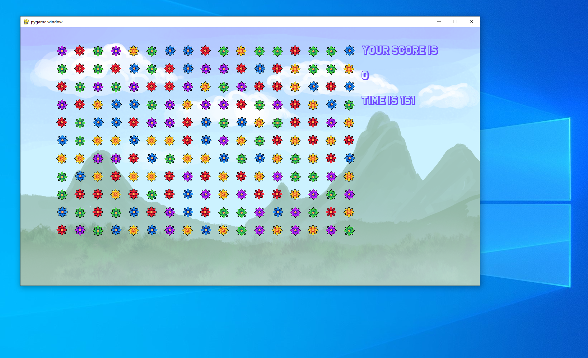

# Flowers

### Description

Flowers a bejeweled like game.

## License
GPLv3 - [read here](https://github.com/Frankmau5/flowers/blob/main/LICENSE)

## Install
### You must have python3 and pip installed !

clone project and go to the flowers folder.
run the requirements.txt file with pip

`pip install -r requirements.txt`

then just double click on the main.py or run 

`python main.py`

In a Terminal
